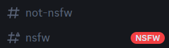
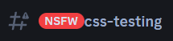
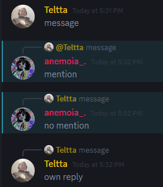
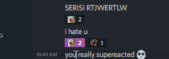

# CSS-Snippets
#### Info
A collection of CSS snippets made for 3rd party Discord clients to "improve" user experience.
If there's an issue with a snippet or you have a request for a snippet, open an issue on this repo.

## [NsfwTags](https://github.com/Teltta/CssSnippets/tree/main/snippets/NsfwTags.css "NsfwTags")
Add NSFW tags to channel titles and channel list.

## [HighlightReplies](https://github.com/Teltta/CssSnippets/tree/main/snippets/HighlightReplies.css "HighlightReplies")
Highlights replies even if the person replying turned of mentioning.

## [RemoveSuperReactions](https://github.com/Teltta/CssSnippets/tree/main/snippets/RemoveSuperReactions.css "RemoveSuperReactions")
Remove stuff regarding Super Reactions and adds a background to them.

