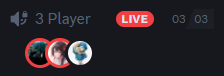
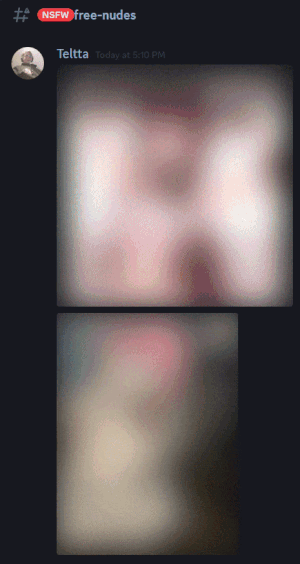
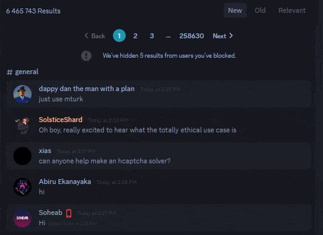

# CSS-Snippets
### Info
A collection of CSS snippets made for 3rd party Discord clients to "improve" user experience.
If there's an issue with a snippet or you have a request for a snippet, open an issue on this repo.

## [NsfwTags](https://github.com/Teltta/CSS-Snippets/tree/main/snippets/NsfwTags.css "NsfwTags")
Add NSFW tags to channel titles and channel list.

## [HighlightReplies](https://github.com/Teltta/CSS-Snippets/tree/main/snippets/HighlightReplies.css "HighlightReplies")
Highlights replies even if the person replying turned of mentioning.

**Note**: You'll have to replace the 4 `user-id`'s with your Discord ID for the snippet to work.

## [RemoveSuperReactions](https://github.com/Teltta/CSS-Snippets/tree/main/snippets/RemoveSuperReactions.css "RemoveSuperReactions")
Remove stuff regarding Super Reactions and adds a background to them.

## [VcHideNames](https://github.com/Teltta/CSS-Snippets/tree/main/snippets/VcHideNames.css "VcHideNames")
Hides names of people in vc and adds a red circle if the person is streaming.

## [BlurNsfwImages](https://github.com/Teltta/CSS-Snippets/tree/main/snippets/BlurNsfwImages.css "BlurNsfwImages")
Blurs images, gifs and videos in NSFW channels.

## [BetterSearch](https://github.com/Teltta/CSS-Snippets/tree/main/snippets/BetterSearch.css "BetterSearch")
Makes controls stick to the top, allows for custom widths and makes every other message different color.

